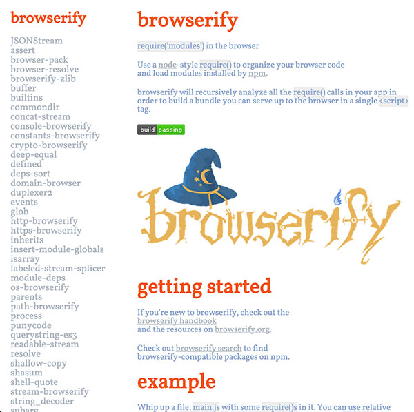

# docs-now



View all readme's as documentation offline with `docs-now`.

[](http://github.com/badges/stability-badges)

## Usage

[](https://www.npmjs.com/package/docs-now)

### Install 
``` 
$ npm i docs-now -g 
```

### After Install

cd into a folder which contains a ```package.json``` and some dependencies. Then run:
```
docs-now
```

Your browser should now open with documentation being rendered. If copy and paste the url from the terminal. For instance from:
```
$ docs-now is running at http://localhost:64190
```


## License

MIT, see [LICENSE.md](http://github.com/mikkoh/docs-now/blob/master/LICENSE.md) for details.
